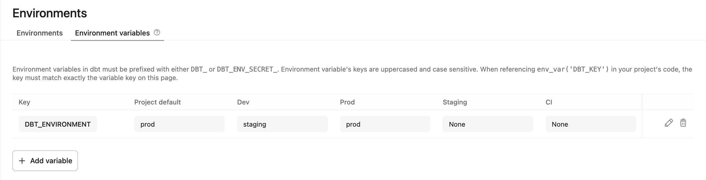
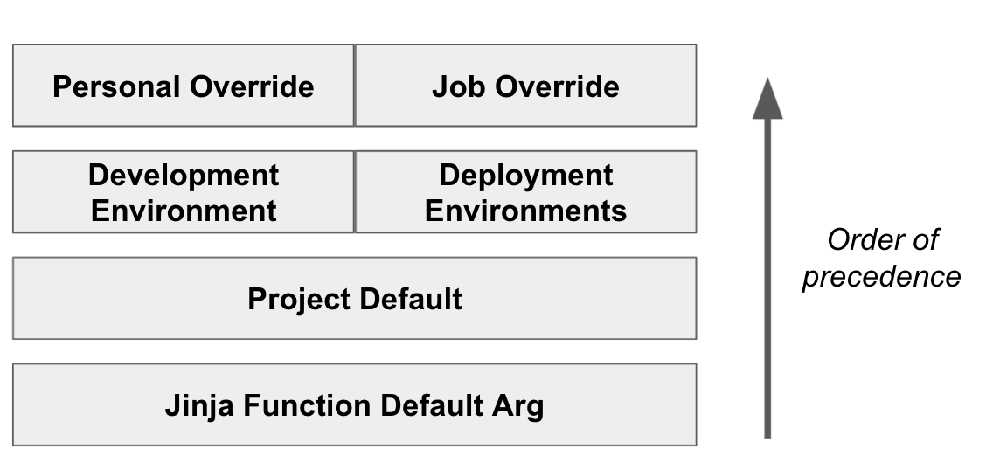

How jinja is rendered
- curly brackets are executable
- nested curly brackets will render as compiled string values

dbt jobs allow you to automate development and deployment environments so data is transformed in ways that are expected and efficient.
## **why ci/cd**

to implement ci/cd you are required to have a git provider and a connection to data platform with multiple databases. the benefit of dbt is that it provides an interface for interacting with git remote repositories that store code and the databases filled with data assets.

the ci/cd workflow with dbt is intended for a team of developers, rather than a single individual. ci features require a minimum Starter plan ($100/month for 5 developer seats). for multi-project environments, dbt offers an enterprise tier with advanced ci features that allow you to compare changes across all production models.

## **ci jobs**

continuous integration allows changes you make on your git branch to be built and tested in a staging area. ci jobs are ran when you make a pull request. it is efficient because only the modified assets and their downstream dependencies are ran. 

a job report is made available in the job run's details or in the Git pull request (refer to the [CI report example](https://docs.getdbt.com/docs/deploy/ci-jobs?version=2.0&name=Fusion#example-ci-report)). 

there are three sections to configure a ci job in dbt: (1) job settings, (2) triggers, and (3) execution settings.

### **job settings**

to get started, you will need to create a separate deployment environment from production. dbt recommends using the staging (stg) deployment type available. A job will also need a name and description.

### **Git triggers**

Developers can trigger the ci job to run with these actions: 

- open a pull request
- push commit to a pull request
- [draft a pull request](https://github.blog/news-insights/product-news/introducing-draft-pull-requests/)

enterprise and enterprise+ plans have access to the Trigger Job Run API endpoint which uses a Pull Request ID to also trigger ci jobs.

>[!Note] Troubleshooting 
>Someone else may make model changes, while your pull request is open. Be sure to merge or rebase the latest branch into your pull request to prevent failed ci jobs.

###  **executions settings**

#### Job commands

schedule a chain of commands with logs and notifications. dbt jobs have checkboxes to run source freshness (first step) and generate docs (last step). the built-in commands include `dbt deps` to install packages and `dbt clone` to create a zero-copy clone in the staging database.

>[!note] Zero Copy Clones
>
>![[../excalidraw/zero-copy-cloning|200]]
>
>Some data warehouses allow you to reference existing data from new database objects. That's free storage on all resources that aren't changed by the developer pull request or merge job.

By default the command list includes a build command to run modified nodes: 

`dbt build --select state:modified+`

dbt has recommended commands for subsequent commands, like semantic validations:

`dbt sl validate --select state:modified+`

You can add as many commands as you needs, but it is good to be aware that job command failures impact downstream nodes differently.

[Continue reading about commands](posts/dbt-commands/index.md)

#### SQL linting

In the execution settings, a checkbox with the fail options is available to lint Pull Requests with SQLFluff. linting automatically enforces style guide rules as model and headcount grows. configure sqlfluff linting rules in  `.sqlfluff` and be sure to exclude snapshots in the `.sqlfluggignore` file. Also, dbt Fusion does not support SQLFluff. 

[Learn more about linting](https://docs.sqlfluff.com/en/stable/inthewild.html#inthewildref)

#### dbt compare (+notes on states)

enterprise and enterprise+ supports can setup dbt compare for a record-level analysis of the latest production state and the pull request. 

the first component in the comparison is a production state, which refers to the metadata files that allow you to "spot the difference" between environments and sets of modified objects, like the ones in yoru pull requests. there are two types of states:

- definition state: what the code says about the pipeline
- applied state: what's stored in the data platform after running or building out the code

the merge job (discussed later) in a cd workflow includes dbt run or dbt build commands which store execution info about run attempts and/or successfule materializations. the Discovery APi's environment endpoint is used to query the applied state of tests, models, seeds, and sources. 

once the applied state of the production environment exists, the record-level comparison can be configured by adding two tests to the `models/<filename>.yml`:

```yaml
models:
	- name: <model_name>
	  
	  # required
	  config:
		  materialized: table
		  contract: {enforced:true}
	
	# model-level constraints
	constraints:
		- type: primary_key
		  columns: [first_column, second_column]
	
	# data tests
	columns:
		- name: <id_column>
		  data_tests:
			  - unique
```

#### Deferral

By default, the manifest from the production environment is used to check the state of the code. instead of building the full table or the entire dag, dbt will only run the modified code.

#### Run timeout

Defaults to one hour, but you can adjust by seconds.

### optional settings

These are advanced methods.

#### Environment Variables

You can safely store information in environments that can be applied across the project or based on the active environment. easiest way to do this in the Studio IDE.



There are multiple contexts to with different priority levels in which you set environment variables.



There are many reasons why environment variables are used. In shared environments, you can store secrets. dbt has special variables to store details related to the dbt platform and git. dbt gives an auditing example, where [special environment variables](https://docs.getdbt.com/docs/build/environment-variables?version=2.0&name=Fusion#special-environment-variables) are stored in models.  if the proper username/password and keypair is stored in the `profiles.yml`, then connection details can be dynamically set based on the environment. 

#### Target name

dbt target names are whatever you named your warehouse connection.  
#### Threads

set the maximum number of paths dbt can take through your DAG.

## ci jobs vs deployment jobs

in collaborative dbt environments, there are concurrent ci checks. this is because a temporary schema is used when the job is triggered by the pull request. this speeds up development because you don't have to wait for jobs to finish. on a more granular level, each new commit you make to a pull request is listened to by the ci job but it not always enqueued. this "smart cancellation of stale builds" is how dbt safely ends the run and start a new one using the new commit. dbt has supported ci jobs so they rarely get in the way of each other or deployment jobs.

pull requests are merged into the main branch. this `git merge` command when a merge job is triggered. similar to triggering ci jobs, there is a Trigger Job Run endpoint available for deployment jobs in the Administrative API. Instead of waiting for developer action, these deployment jobs can be integratied with schedulers and platforms, like [Airflow](https://docs.getdbt.com/docs/deploy/continuous-deployment?version=2.0). merge jobs work in two ways:

- `dbt build --select state:modified+` - by default, build changes.
- `dbt compile` - refresh the applide state to track changes in the `manfiest.json` file

merge jobs have similar settings as ci jobs, but the option differ slightly.

- **job settings**: name, description, and environment
- **git trigger**: run on merge to a main branch
- **execution settings**: run command list and compare changes unless no deferral is set.
- **advanced settings**: environment variables, target name, run timeout, and threads.

## Summary

ci/cd is how you can automate your development and deployment workflows. dbt listens out for developer branches committing changes to a pull request to update the project metadata. merge jobs are ran those changes are merged into the main branch. dbt offers advanced features for record-level comparison and api triggers to further support developer teams.

# Packages

Next, [dbt-practice-quizzes](docs/dbt-practice-quizzes.md)


