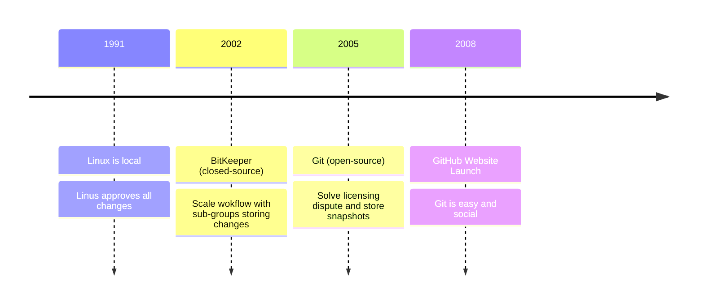

## What Problem Does Git Solve?

One of the books on my winter reading list was Linus Torvald’s “Just for Fun,” where he recounts the origins of the programs he’s most famous for authorin — the Linux operating system kernel and Git, an open-source distributed version control system.

Linux started as a personal project on Linus’ computer. Basically form teh start, he shared the project on public forums where it eventually grew into a community supported program. In the early days, Linus would manually approve all contributions. This was okay for developers who were willing to wait for a slow difference engine to identify changes between releases and send him an email with their recommended code. 

When the Linux commmunity grew into the thousands, they compromised to use a propriety distributed version control system called BitKeeper to help manage code changes. Great! Linus didn’t have to approve everything by himself. And, specialized sub groups could develop independently. Unfortunately, their closed-source DVCS meant they couldn’t modify the system to meet their needs. Not ideal for an open-source project founded on build-it-yourself mentality.

Just a few years later, they decided to solve their licensing issuse by developing their own, new and improved DVCS which:

- Stores snapshots of file paths and contents, instead of only differences.
- Exists on your local machine
- Has the ability to connect to remote serves for distributed system development

**Think of it like Google docs for programmers.**

## Git vs. GitHub

Git is local.

GitHub, GitLab, and BitBucket host remote servers which allow you to store tracked files on their platform. These platforms not only provide storage, but a social environment to collaborate with anyone in the world. Other features they may layer on top of git include:

- Pull requests and code review
- Project Management boards and discussions
- [CI/CD](https://about.gitlab.com/topics/ci-cd/) with tools, like GitHub Actions.

And other interesting offers, like web hosting, online IDEs, and AI tools.

Stay tuned for Part II: Git Fundamentals and happy coding!