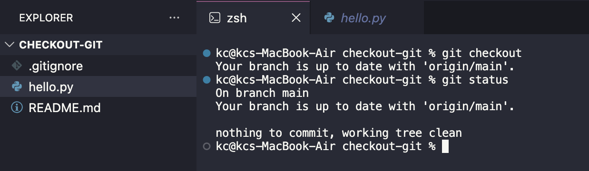
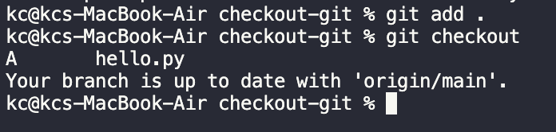
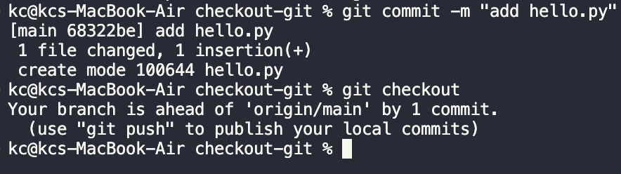
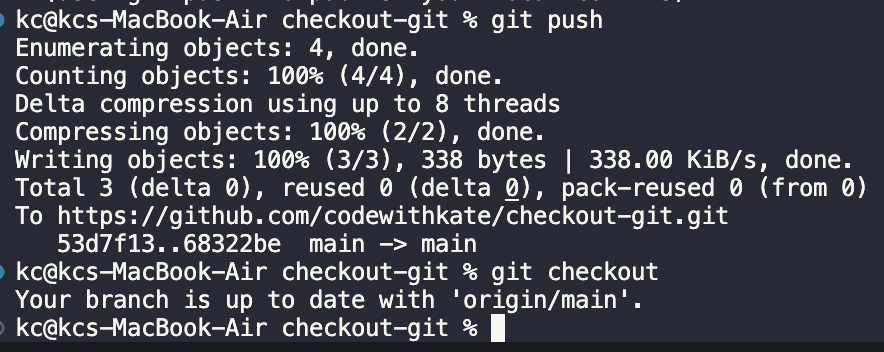
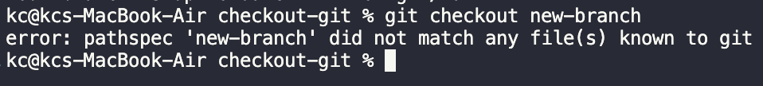
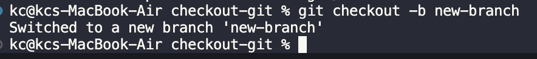
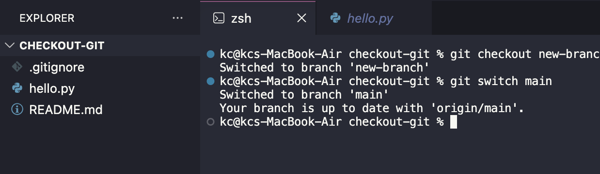
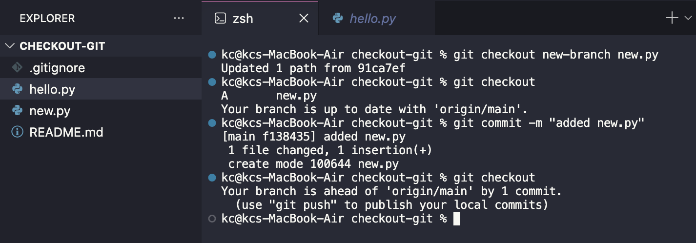
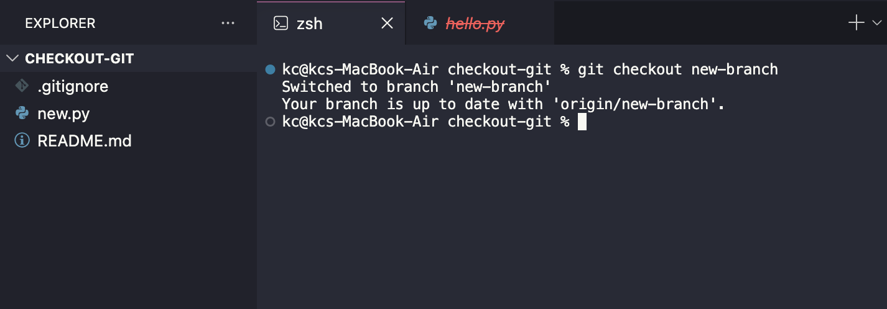
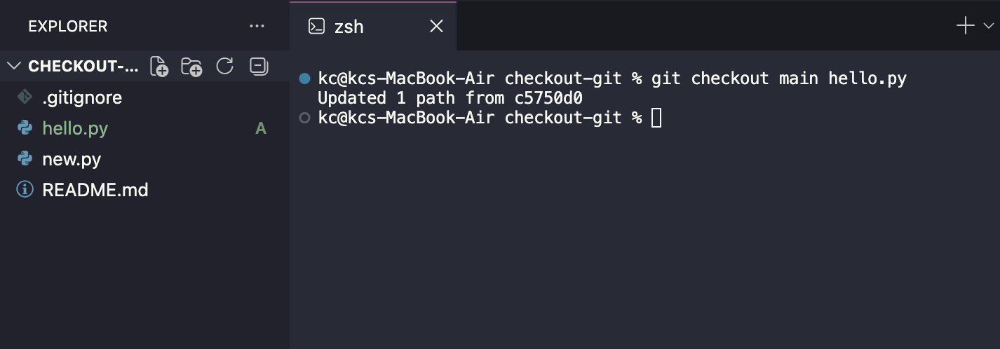

**Learning** git can fell overwhelming when there are so many commands and options. This is especially true for the `checkout` command which has more than one meaning AND there are alternative commands to do the same thing.

I try to simplify `git checkout` into five scenarios:

1. Get information about the current branch.
2. Create a new branch.
3. Switch to a new branch.
4. Restore or add a file from another branch.
5. Delete a file by overwriting with another branch or file.

## Scenario 1: Branch status

Without any arguments or options, we can check the status of our working branch to make sure it is up to date.


*git checkout and git status*

We can use `git checkout` to tell if your branch is up to date. Alternatively, `git status` does this and tells us your current working branch and checks for any local commits.

### Three Copies Concept

When you name a branch, you get two separate copies of that branch:

**Local branch:** any branch on your computer

**Remote branch**: a branch on the server you interact with via push/pull

You make new commits to your local branch and push those changes to the remote branch. If you don’t push those commits then your local and remote branches will be out of sync, even though they have the same name.

It’s important to note that checkout is only tracking commits. Although the checkout will show the files that I have changed, it would still consider my branch to be up to date with the main branch.

You can see this best when you know you have `add`ed changes to your branch, but `checkout` still shows that it’s up to date with the remote.


*git add and checkout*

Once you `commit` those changes to your current branch, the `checkout` will show if you are ahead (or behind) the remote branch.


*git commit and git checkout*

Be sure to `push` to keep your local commit(s) in sync with the remote branch.


*git push and git checkout*
## Scenario 2: Create A Branch

Having knowledge of the **two copy concept**, we can introduce the first checkout argument: `<branch>` 

You will get an error if you try to call `git checkout <new-branch>` and a branch of that name does not exist.


*git checkout non existing branch*

**Create a new branch** by using the `-b` option. Git will automatically switch you to this branch upon creation.


*git checkout to create a new branch*
## Scenario 3: Switch Branches

It’s best practice to make all changes away from the main branch. You can use the `checkout` or `switch` commands to switch to different branches.


*git checkout and git switch*

Use whichever command you prefer.

## Scenario 4: Add File From Branch

Here, we introduce the a second checkout argument: `<file>` 

This allows you specify a specific file to checkout from another branch with the `git checkout <branch> <file>` command.


*git checkout to add a new file*

Here are the steps to bring up a file form another branch:

- Checkout a file to add it to the working directory
- Add the file to the local branch
- Commit the file to the local branch

Finally, you push the commit to the remote branch to sync changes.

## Scenario 5: Delete a file

It’s important to note that Git is replacing all the current branch’s file paths with the paths from the branch you are switching to. This means that switching branches could delete files in your working directory if they don’t exist in the branch you’ve switch to.

This is the case my example where I only had the [new.py](http://new.py) file in the new-branch. Luckily, I kept the [hello.py](http://hello.py) file open in my IDE. However, it is not listed in the working directory and the name is crossed out in red to show it’s been deleted.


*git checkout to delete a file*

## Scenario 6: Restore File From Branch

If you have switched to a repo and accidently a file you still hav open, then you can simply save it to bring it back to your working directory. However, the file will be untracked in your local and remote branches.

If a version of the file exists on another branch or you were unlucky enough to not have the file you need open, you can use `git checkout branch file` to restore files.


*git checkout to restore a file*

For example, [hello.py](http://hello.py) can be restored from the main version. You’ll still need to follow the steps for publishing these changes as a commit to the current branch.

Yes, we just used the same command as we did to add a new file. This is because Git is using paths and will simply bring in content. There are other tools for managing differences. Feel free to explore those options in the docs: [https://git-scm.com/docs/git-checkout](https://git-scm.com/docs/git-checkout)

## Bonus: actions/checkout

Everything up tot his point has been using `git checkout` on your local machine.

There are other platforms, like GitHub, that provide layers on top of git commands that allow to achieve skills, like CI/CD (continuous integregation/continuous deployment).

GitHub Actions has a checkout feature that makes a copy of your repository for you to use . Similar to the local command, you can choose specific files. 

```
insert code
```

Read more at [https://github.com/actions/checkout](https://github.com/actions/checkout)

Happy coding!